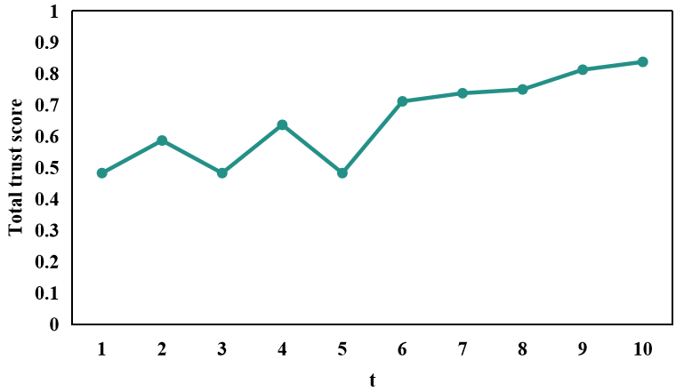
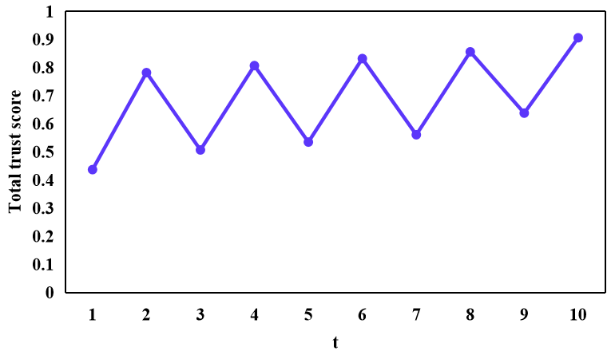
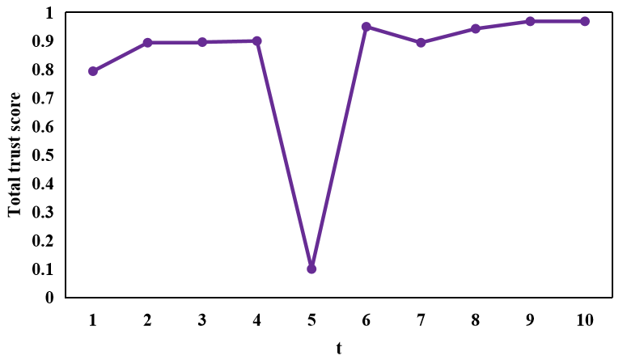

# Trust — IoV: An Open Benchmark Dataset for Trust Management in the Internet of Vehicles

    

    

    

# A specimen of the envisaged trust-based IoV dataset encompassing the trust parameters and labels.
| Trustor | Trustee | Interaction Experience  |Interaction Frequency| Interaction Timeliness| Received Message Quality |MaliciousVehicle | IsAttacking| 
| :------: |  :----:  | :-------:| :------: | :----: | :------: |:------: | :----: | 
|0|8|1.000|0.500|1.000|1.000|No|No|
|0|24|0.400|0.143|1.000|0.600|No|No|
|0|92|0.800|0.071|1.000|0.800|No|No|
|.|.|.|.|.|.|.|.|.|
|10|15|0.900|0.111|1.000|1.000|No|No|
|10|57|0.300|0.001|0.244|0.600|No|No|
|10|81|0.600|0.100|1.000|0.600|No|No|
|.|.|.|.|.|.|.|.|.|
|19|20|0.300|0.013|0.653|0.600|No|No|
|19|25|0.300|0.006|0.326|0.600|No|No|
|19|92|0.800|0.125|1.000|0.800|No|No|
|.|.|.|.|.|.|.|.|.|
|24|32|0.300|0.019|0.763|0.600|No|No|
|24|81|0.500|0.143|1.000|0.600|No|No|
|24|93|0.500|0.111|1.000|0.600|No|No|
|.|.|.|.|.|.|.|.|.|
|36|39|0.500|0.012|1.000|0.600|No|No|
|36|61|0.300|0.001|0.249|0.600|No|No|
|36|89|0.400|0.002|0.498|0.600|No|No|
|.|.|.|.|.|.|.|.|.|
|42|58|0.700|0.111|1.000|0.800|No|No|
|42|75|0.600|0.022|1.000|0.600|No|No|
|42|90|0.400|0.007|0.965|0.600|No|No|
|.|.|.|.|.|.|.|.|.|
|61|63|1.000|0.048|1.000|1.000|No|No|
|61|82|0.400|0.005|0.684|0.600|No|No|
|61|93|0.700|0.097|1.000|0.800|No|No|
|.|.|.|.|.|.|.|.|.|
|73|75|0.900|0.098|1.000|1.000|No|No|
|73|76|0.800|0.267|1.000|0.800|No|No|
|73|87|1.000|0.048|1.000|1.000|No|No|
|.|.|.|.|.|.|.|.|.|
|80|81|0.400|0.012|0.895|0.600|Yes|Yes|
|80|88|0.900|0.226|1.000|1.000|Yes|No|
|80|93|0.800|0.173|1.000|0.800|Yes|Yes|
|.|.|.|.|.|.|.|.|.|
|85|87|0.300|1.000|0.392|0.600|Yes|Yes|
|85|92|0.700|0.268|0.941|0.800|Yes|Yes|
|85|95|0.700|0.031|0.521|0.800|Yes|Yes|
|.|.|.|.|.|.|.|.|.|
|90|91|0.700|0.243|1.000|0.800|Yes|Yes|
|90|93|0.300|0.074|1.000|0.600|Yes|No|
|94|95|0.600|1.000|1.000|0.600|Yes|Yes|
